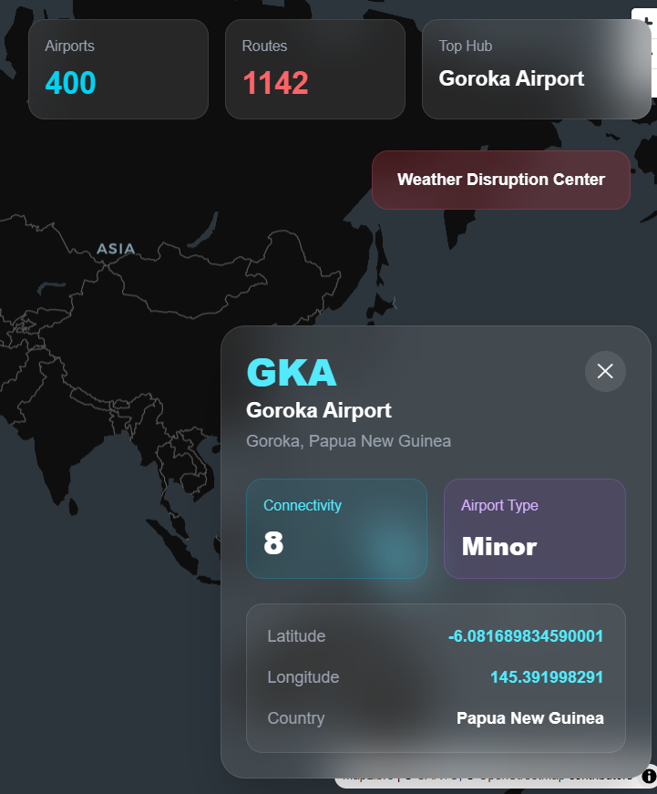
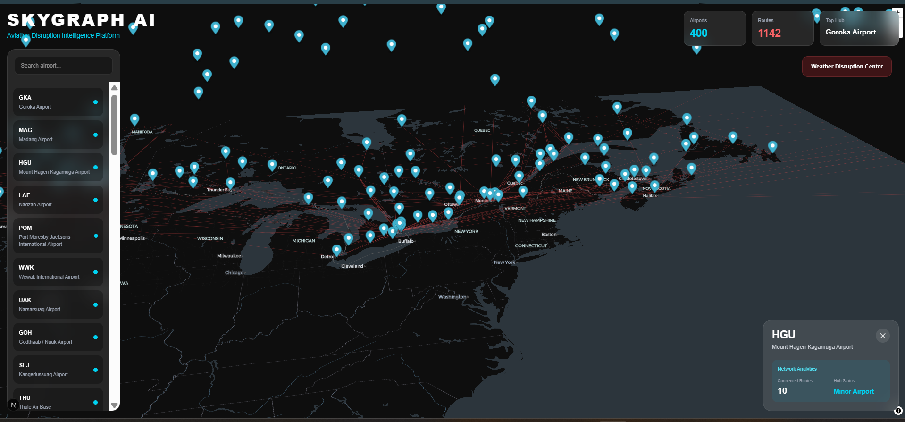
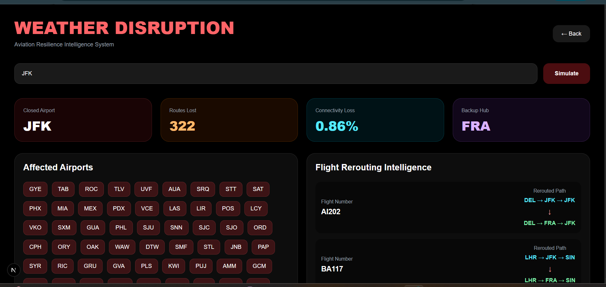
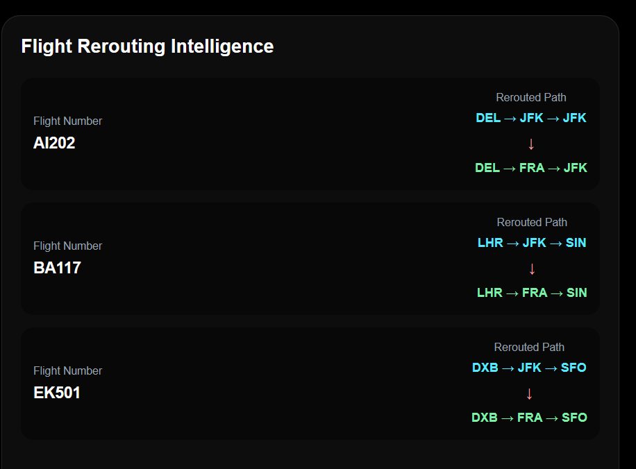

# SkyGraph AI

SkyGraph AI is a full-stack aviation intelligence and disruption analysis platform designed to visualize global airport connectivity, simulate operational disruptions, and analyze aviation network resilience.

The platform combines geospatial visualization, aviation route intelligence, backend analytics, and operational disruption simulation into a unified dashboard-based system.

---

# Features

## Global Aviation Network Visualization

- Interactive world map using MapLibre GL
- Visualization of airport nodes and airline route networks
- Dynamic route rendering between airports
- Airport-based geospatial analytics

## Airport Intelligence Dashboard

- Airport search functionality
- Airport detail analytics panel
- Connectivity analysis
- Latitude and longitude information
- Hub classification:
  - Major Hub
  - Regional Hub
  - Minor Airport
- Top connected routes
- Route weight analysis
- Aviation influence metrics

## Weather Disruption Simulation

Dedicated disruption analysis center capable of simulating airport shutdown scenarios.

Features include:

- Airport disruption simulation
- Connectivity loss analysis
- Route impact calculation
- Affected airport detection
- Alternative hub recommendation
- Aviation resilience analytics
- Operational intelligence dashboard

## Flight Rerouting Intelligence

The platform generates rerouting suggestions during disruption scenarios.

Includes:

- Simulated rerouted flight paths
- Flight identifiers
- Alternative routing hubs
- Operational continuity analysis

## Backend Intelligence Engine

The backend provides:

- REST APIs
- Route intelligence processing
- Aviation network analysis
- Disruption impact calculations
- Connectivity analytics
- Rerouting recommendation generation

---

# Tech Stack

## Frontend

- Next.js
- React
- TypeScript
- Tailwind CSS
- MapLibre GL

## Backend

- FastAPI
- Python

## Database

- MongoDB

## Data Processing

- CSV aviation datasets
- Custom route processing pipelines

---

# System Architecture

```text
Frontend (Next.js + React)
        ↓
REST API Layer (FastAPI)
        ↓
MongoDB Database
        ↓
Aviation Intelligence Engine
```

---

# Project Structure

```text
Airport_App/
│
├── backend/
│   ├── main.py
│   ├── database.py
│   ├── requirements.txt
│   └── ...
│
├── frontend/
│   ├── app/
│   │   ├── page.tsx
│   │   ├── disruption/
│   │   │   └── page.tsx
│   │   └── ...
│   │
│   ├── public/
│   ├── package.json
│   └── ...
│
└── README.md
```

---

# Installation

## Clone Repository

```bash
git clone <repository_url>
cd Airport_App
```

---

# Backend Setup

## Navigate to Backend

```bash
cd backend
```

## Create Virtual Environment

### Windows

```bash
python -m venv venv
venv\Scripts\activate
```

### Linux / macOS

```bash
python3 -m venv venv
source venv/bin/activate
```

## Install Dependencies

```bash
pip install -r requirements.txt
```

## Start Backend Server

```bash
uvicorn main:app --reload
```

Backend will run on:

```text
http://127.0.0.1:8000
```

API documentation available at:

```text
http://127.0.0.1:8000/docs
```

---

# Frontend Setup

## Navigate to Frontend

```bash
cd frontend
```

## Install Dependencies

```bash
npm install
```

## Run Frontend

```bash
npm run dev
```

Frontend will run on:

```text
http://localhost:3000
```

---

# API Endpoints

## Root Endpoint

```http
GET /
```

Returns backend status.

---

## Get Top Airports

```http
GET /top-airports
```

Returns aviation airport dataset.

---

## Get Routes

```http
GET /routes
```

Returns aviation route network data.

---

## Simulate Weather Disruption

```http
GET /simulate-disruption/{airport_code}
```

Example:

```http
GET /simulate-disruption/JFK
```

Returns:

- disrupted routes
- connectivity loss
- affected airports
- rerouting intelligence
- alternative hub recommendations

---

# Core Algorithms

## Connectivity Analysis

Measures airport importance using:

- route density
- route frequency
- network integration

## Disruption Impact Analysis

Calculates:

- route losses
- affected airports
- operational degradation

## Alternative Hub Recommendation

Identifies substitute aviation hubs based on:

- remaining connectivity
- network resilience
- route concentration

## Flight Rerouting Intelligence

Generates alternative routing strategies for disrupted flight paths.

---

# Future Enhancements

Potential future improvements include:

- Real-time flight tracking
- Live weather integration
- Predictive disruption analytics
- Machine learning-based delay prediction
- Airline-specific route intelligence
- Passenger flow analysis
- Cargo network optimization
- Interactive graph analytics
- Airport congestion forecasting
- AI-based operational recommendations

---

# Educational Value

This project demonstrates concepts related to:

- Full-stack web development
- Geospatial visualization
- Aviation analytics
- Network science
- Operational intelligence systems
- Backend API development
- Database integration
- Graph-based analysis
- Disruption simulation
- Aviation resilience engineering

---

# License

# Screenshots

## Main Airport Dashboard

<p align="center">
  
</p>

---

## Global Aviation Route Network

<p align="center">
  
</p>

---

## Weather Disruption Intelligence Center

<p align="center">
  
</p>

---

## Flight Rerouting Intelligence

<p align="center">
  
</p>

This project is intended for educational and portfolio purposes.